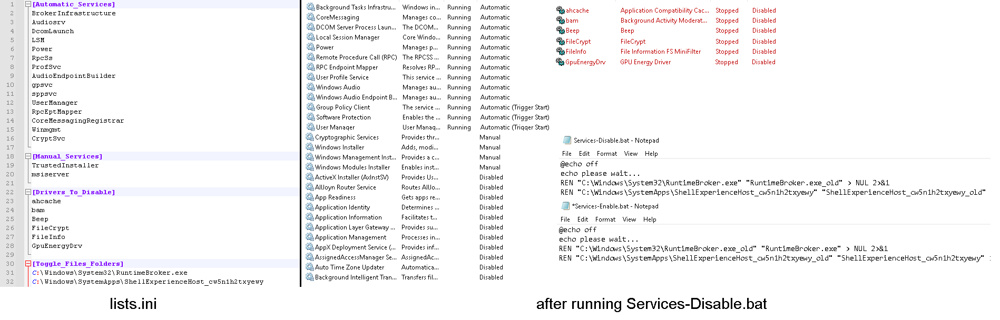

## Service-List-Builder
CLI tool to build scripts to toggle between minimal & default services in Windows based on user defined lists.

Contact: https://twitter.com/amitxv

## Disclaimer
I am not responsible for damage caused to computer. This tool is powerful & for advanced users only. There is a risk of damaging your operating system if you disable core services that are required for windows to function correctly. It is your responsibility to use suitable service configurations for your specific operating system. It is also recommended that you use this tool before installing any programs as any other services not defined in the lists will be disabled (e.g services installed by anticheats, or you could simply enable them after building the scripts but the first method is recommended).

## Usage
- Download the latest release from the [releases tab](https://github.com/amitxv/Service-List-Builder/releases).

- Open lists.ini in a text editor.

- [Required] Import your service list seperated by new lines under the ``[Automatic_Services]`` and ``[Manual_Services]`` sections. Whatever services you do not specify under these fields will get disabled.

- [Optional] Additionally You can also import a list of drivers to be disabled seperated by new lines under the ``[Drivers_To_Disable]`` section.

- [Optional] Additionally you can include full folder paths or binaries (without quotes) to get renamed to _old under the ``[Toggle_Files_Folders]``.

  ```
  Note: 
  
  - All lists are case sensitive

  - This tool automatically handles driver filters for  the following:
    - EhStorClass
    - fvevol
    - iorate
    - rdyboost
    - ksthunk
    - volsnap

  ```
- Run main.exe to build the scripts. 

- The scripts will be built in the ``build`` folder. Nsudo is required to run the scripts with with "Enable All Privilages" checkbox enabled to prevent errors when writing to registry & renaming files.

## Example

- After running ``Services-Disable.bat`` with Nsudo, all services except those that i defined in the lists will be disabled. (This list was used on Windows 10 1709)

     